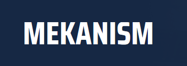
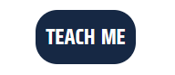

# [THE MEKANISM WIKI](https://code-lau.github.io/Mekanism_Wiki)

Mekanism is an independent tech mod created by Aiden Brady that brings low, mid, and high tier machinery to Minecraft. Mekanism excels at making your life easier with automation through a scientific and chemistry based approach. This project aims to encapsulate everything Mekanism has to offer in a concise and detailed guide. This project is a guide first, wiki second, and will be receiving dedicated item pages in the near future. This guide is specifically for those who are playing the mod individually or as part of a modpack. From following this guide players will be able to:

-Follow guides on how to install Mekanism individually or through launchers/modpacks.
 
-Follow guides on the processes of machine-making.
 
-Build factories for automation and power.
 
-Learn how to best use equipment and modify them.

Mekanism was first released on May 27th, 2017 and since then has been a pillar of tech in modpacks. Despite this, there is only one very old wiki and almost next to no coverage of the details. For a new player, searching for information comes in the form of outdated youtube videos and reddit posts. This project will change that, giving players an up to date and relevant guide from the smallest details to large and complicated factories. The end goal for this project is to the be main site people come to for information. The hope is that no one will be confused, absorbing incorrect or outdated info and that it is user friendly and accessible to all who may need it.

## UX
Given that this is a wiki/guide page and not a normal website that advertises products, the design was a delicate approach. I had to come up with something unqiue and eye-catching without it being too flashy or distracting. I was automatically locked out of a lot of designs due to the content on the page. I ended up deciding on the diagonal header and footer, I felt that not only did this look smart and match the theme, but that it framed the limited content better. These are automatically disabled in mobile and tablet versions so as to not crowd the screen, but the iconic blue stays. This is paired with a simple hamburger/bar menu that animates on touch.

### Colour Scheme

For the colour scheme, I went with a dark blue to make it feel industrial and tech-related. Adding the white as contrast makes it easy on the eyes. I used [coolors.co](https://coolors.co/162844-2e5592-e0ffff-ffffff) as a visual aid in choosing the palette.

- `#162844` used for primary text.
- `#2E5592` used for primary highlights.
- `#FFFFF` used for secondary text.
- `#E0FFFF` used for secondary highlights.

### Typography
The font used primarily on this website is [Saira Condensed.](https://fonts.google.com/specimen/Saira) I chose this font specifically because it closely matches what the creator chose for his logo. It also encapsulates the feeling of "tech" and "sci-fi" with it's harsh edges and tall line-height. This is used for all texts, and should the user's browser not support it, it defaults to [Tahoma]() and [Verdana]() as the backups.

For the social icons, originally I had edited some by hand in photoshop before I understood that I could call upon websites and their icons, such as [FontAwesome.](https://fontawesome.com/) FontAwesome became my go-to for the social icons.

## Features

### Existing Features

- **Logo**

    - The logo bears the title and when clicked, brings the user to the main page. This was implemented in case the user wanted a quick way to return to the main page without using the home link.

- **Nav Menu**

    - The nav menu features a home link, a link to the about page, a guide button and a link to the downloads page. The guide button reveals the guide content through hovering on desktop, and a clickable dropdown menu on mobile. This shows five more items that link to the corresponding pages. This was implemented so that the user wouldn't have to go navigate the guide through the buttons only.

- **Guide Buttons**

    - I created buttons that direct you straight to the guide page rather than making the user search for it. That way the user can move to whatever section they need to at the suggested pace.

### Future Features

- **An Item and Material List**
    -Ideally I would like to add a page for every item and material added in the mod, complete with descriptions, guides on how to aquire said items and links to corresponding items or machines. These items would all be listed by category on a single parent page.
- **Search Bar**
    -This would also warrent the implementation of a search bar in case the user only wishes to search for certain items. This would likely be alongside the nav menu.

## Tools & Technologies Used
For this project, I mainly used gitpod to code in, and github to host my repository. GitHub Pages was used for deployment of the front-end site. For the main site content, I used HTML. CSS for the design and layout and Javascript for functionality. I used TinyPng and Webp Converter for all images used on the site to make them smaller and webp format respectively. I used the Fluid Typography Calculator when following guides and swapping to more efficient units of measurement I wasn't used to, such as em, vh, vw and rem. I used Figma to design the wireframe. Lastly I used Font Awesome for all the social icons.

-  used to generate README and TESTING templates.
-  used for version control. (`git add`, `git commit`, `git push`)
-  used for secure online code storage.
-  used as a cloud-based IDE for development.
-  used for the main site content.
-  used for the main site design and layout.
-  used for user interaction on the site.
-  used for hosting the deployed front-end site.
-  used as the relational database management.
-  used as the Postgres database from Code Institute.
- []used for the images.
- []used for the images.
- []used for box content.
-  used for creating wireframes.
-  used for the icons.
