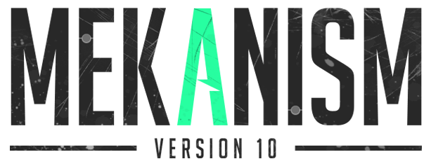

# [THE MEKANISM WIKI](https://code-lau.github.io/Mekanism_Wiki)

Mekanism is an independent tech mod created by Aiden Brady that brings low, mid, and high tier machinery to Minecraft. Mekanism excels at making your life easier with automation through a scientific and chemistry based approach. This project aims to encapsulate everything Mekanism has to offer in a concise and detailed guide. This project is a guide first, wiki second, and will be receiving dedicated item pages in the near future. This guide is specifically for those who are playing the mod individually or as part of a modpack. From following this guide players will be able to:

-Follow guides on how to install Mekanism individually or through launchers/modpacks.

-Follow guides on the processes of machine-making.

-Build factories for automation and power.

-Learn how to best use equipment and modify them.

Mekanism was first released on May 27th, 2017 and since then has been a pillar of tech in modpacks. Despite this, there is only one very old wiki and almost next to no coverage of the details. For a new player, searching for information comes in the form of outdated youtube videos and reddit posts. This project will change that, giving players an up to date and relevant guide from the smallest details to large and complicated factories. The end goal for this project is to be the main site people come to for information. The hope is that no one will be confused, absorbing incorrect or outdated info and that it is user friendly and accessible to all who may need it.

Here is a demonstration of responsiveness, done through [Am I Responsive?](https://ui.dev/amiresponsive?url=https://code-lau.github.io/Mekanism_Wiki/), a website that showcases any website through the eyes of all viewports in an interactive manner.

## UX
Given that this is a wiki/guide page and not a normal website that advertises products, the design was a delicate approach. I had to come up with something unqiue and eye-catching without it being too flashy or distracting. I was automatically locked out of a lot of designs due to the content on the page. I ended up deciding on the diagonal header and footer, I felt that not only did this look smart and match the theme, but that it framed the limited content better. These are automatically disabled in mobile and tablet versions so as to not crowd the screen, but the iconic blue stays. This is paired with a simple hamburger/bar menu that animates on touch.

### Colour Scheme

For the colour scheme, I went with a dark blue to make it feel industrial and tech-related. Adding the white as contrast makes it easy on the eyes. I used [coolors.co](https://coolors.co/162844-2e5592-e0ffff-ffffff) as a visual aid in choosing the palette.

- `#162844` used for primary text.
- `#2E5592` used for primary highlights.
- `#FFFFF` used for secondary text.
- `#E0FFFF` used for secondary highlights.

### Typography
The font used primarily on this website is [Saira Condensed.](https://fonts.google.com/specimen/Saira) I chose this font specifically because it closely matches what the creator chose for his logo. It also encapsulates the feeling of "tech" and "sci-fi" with it's harsh edges and tall line-height. This is used for all texts, and should the user's browser not support it, it defaults to Tahoma and Verdana as the backups.

For the social icons, originally I had edited some by hand in photoshop before I understood that I could call upon websites and their icons, such as [FontAwesome.](https://fontawesome.com/) FontAwesome became my go-to for the social icons.

## Features

### Existing Features

**Logo**

- The logo bears the title and when clicked, brings the user to the main page. This was implemented in case the user wanted a quick way to return to the main page without using the home link.

**Nav Menu**

 - The nav menu features a home link, a link to the about page, a guide button and a link to the downloads page. The guide button reveals the guide content through hovering on desktop, and a clickable dropdown menu on mobile. This shows five more items that link to the corresponding pages. This was implemented so that the user wouldn't have to navigate the guide through the buttons only.

**Guide Buttons**

- I created buttons that direct you straight to the guide page rather than making the user search for it. That way the user can move to whatever section they need to at the suggested pace.

**Email**

- An email link is displayed at the bottom left of the screen to allow the users to contact the author. Users would ideally contact the author about bug fixes or suggestions. 

**Socials**

- An icon for X (Twitter), Github and LinkedIn are displayed at the bottom right of the screen to allow the users to get in touch via those platforms, or to simply follow the production of the mod. 

   

**Guide Page**

- The guide page contains content that users can follow to accomplish their goals or figure out how to solve their problems. It contains many images relevant to the guide text and is written in a clear and consise way.

- On the guide page is a detailed table showing users what each item is worth in terms of fuel. By structuring this information in a table, the content is much more digestable to users. The colours, though gaudy, represent the corresponding items, making it easier for users to hone in on exactly what they're looking for through colour association.

**Back to the top**

- On the guide page and any other page with a lot of scrollable content, there is a small icon of a Minecraft Diamond Pickaxe that acts as a button to return the user to the top of the screen. This allows users to navigate through the site quickly by bringing them to back to the nav menu whenever they like. 

**About Page**

- The about page explains and encourages users to use Mekanism whilst also displaying a video to introduce them to the mod. The video is interactable, allowing the users to pause, play, expand it to fullscreen and to turn up and down the volume.

**Downloads Page**    

- The downloads page includes four download links, each with their own clickable title and clickable image that leads to the respective content. Below this is a comprehensive guide on how to install these mods.

### Future Features

**An Item and Material List**
- Ideally I would like to add a page for every item and material added in the mod, complete with descriptions, guides on how to aquire said items and links to corresponding items or machines. These items would all be listed by category on a single parent page.

**Search Bar**
- This would also warrent the implementation of a search bar in case the user only wishes to search for certain items. This would likely be alongside the nav menu.

## Tools & Technologies Used
- For this project, I mainly used gitpod to code in, and github to host my repository. GitHub Pages was used for deployment of the front-end site. For the main site content, I used HTML. CSS for the design and layout and Javascript for functionality. I used TinyPng and Webp Converter for all images used on the site to make them smaller and webp format respectively. I used the Fluid Typography Calculator when following guides and swapping to more efficient units of measurement I wasn't used to, such as em, vh, vw and rem. I used Figma to design the wireframe. Lastly, I used Font Awesome for all the social icons.

-  used to generate README and TESTING templates.
-  used for version control. (`git add`, `git commit`, `git push`)
-  used for secure online code storage.
-  used as a cloud-based IDE for development.
-  used for the main site content.
-  used for the main site design and layout.
-  used for user interaction on the site.
-  used for hosting the deployed front-end site
- [] used for the images.
- [] used for the images.
- [] used for box content.
-  used for creating wireframes.
-  used for the icons.

## Testing
Please refer to the [TESTING.md](/workspace/Mekanism_Wiki/TESTING.md) file.

## Deployment
This site was deployed to [GitHub Pages.](https://code-lau.github.io/Mekanism_Wiki/)

### Local Deployment

This project can be cloned or forked in order to make a local copy on your own system.

#### Cloning

You can clone the repository by following these steps:

1. Go to the [GitHub repository](https://github.com/Code-Lau/Mekanism_Wiki)
2. Locate the Code button above the list of files and click it
3. Select if you prefer to clone using HTTPS, SSH, or GitHub CLI and click the copy button to copy the URL to your clipboard
4. Open Git Bash or Terminal
5. Change the current working directory to the one where you want the cloned directory
6. In your IDE Terminal, type the following command to clone my repository:
	- `git clone https://github.com/Code-Lau/Mekanism_Wiki.git`
7. Press Enter to create your local clone.

Alternatively, if using Gitpod, you can click below to create your own workspace using this repository.

Please note that in order to directly open the project in Gitpod, you need to have the browser extension installed.
A tutorial on how to do that can be found [here](https://www.gitpod.io/docs/configure/user-settings/browser-extension).

#### Forking

By forking the GitHub Repository, we make a copy of the original repository on our GitHub account to view and/or make changes without affecting the original owner's repository.
You can fork this repository by using the following steps:

1. Log in to GitHub and locate the [GitHub Repository](https://github.com/Code-Lau/Mekanism_Wiki)
2. At the top of the Repository (not top of page) just above the "Settings" Button on the menu, locate the "Fork" Button.
3. Once clicked, you should now have a copy of the original repository in your own GitHub account!

### Local VS Deployment

After testing both the local version hosted by Gitpod, and the live version hosted by GitHub Pages I observed no notable differences.

## Credits
All code referenced does not belong to me and is borrowed expressly for learning purposes.

| [W3Schools](https://www.w3schools.com/css/css3_variables.asp) | HTML img tag, Border Color, CSS Syntax, CSS Borders, CSS Introduction, Colors, HTML Styles CSS, CSS Margin Collapse, CSS Border Sides, CSS Border Width, Fixed Sidebar, Flex-wrap Property, Web Safe Fonts, CSS Vertical Navigation Bar, CSS Horizontal Navigation Bar, CSS Line-height Property, Styling Links|

| [CodePen](https://codepen.io/miguelznunez/pen/QWvPmEx) | Responsive Navigation Menu | Used on all html pages and burger.js |

| [YouTube](https://www.youtube.com/watch?v=samof05Dy6A) | Create a Responsive Dropdown Menu | Dropdown Menu used in all html pages. |
    
| [Youtube](https://www.youtube.com/watch?v=0gCMLAivggc) | Non-Rectangular Header Using CSS Polygon | Used in all html pages |

| [YouTube](https://www.youtube.com/watch?v=IXucQAEkIMo&t=358s) | Responsive Website Using HTML And CSS | Logo, Navbar and Hamburger Menu used in all html pages. Scroll Reveal used in all html pages and script.js |

| [YouTube](https://www.youtube.com/watch?v=YesSVqjcDts&t=803s) | How to create the side navigation bar using html and css | Used on all html pages |

| [Stack Overflow](https://stackoverflow.com/questions/2237540/how-do-i-load-external-fonts-into-an-html-document) | How to load external fonts into an HTML document? | Used in style.css |

| [Stack Overflow](https://stackoverflow.com/questions/34957568/how-to-write-html-in-uk-english) | How to write HTML in UK English? | Used in all html pages |

| [Stack Overflow](https://stackoverflow.com/questions/2237540/how-do-i-load-external-fonts-into-an-html-document) | How do I load external fonts into an HTML document? | Used in style.css |

## Content
- Minecraft, and all Minecraft names, related logos, fonts, textures, graphics, images, models, sounds and any other distinctive characteristics of any part of their name and games belong to Mojang AB and the Microsoft Corporation. This project is not official or approved by, endorsed by, associated with, supported by or connected to Mojang and Microsoft. I am not associated with with Mojang or Microsoft in any way. 
    
- The Mekanism mod was created by Aiden Brady. All guide images and video clips are from this mod and are owned by Aiden Brady and his team. I am not associated with Mekanism or it's creator/team in any way.

- [Minecraft Wiki](https://minecraft.wiki/)

- [Mekanism Curseforge Page](https://www.curseforge.com/minecraft/mc-mods/mekanism)

    
## Media
| [Minecraft Wiki](https://minecraft.fandom.com/ru/wiki/Mekanism) | Mekanism V10 Logo and Minecraft Diamond Pickaxe icon |

| [YouTube](https://www.youtube.com/watch?v=Jve-WgrF4Lc) | Audio used in showcase video |
    
| [Mekanism Curseforge Page](https://www.curseforge.com/minecraft/mc-mods/mekanism) | All screenshots and footage are taken directly from the Mekanism mod software |

## Acknowledgements
- I would like to thank my (very cool) Code Institute mentor, [Tim Nelson](https://github.com/TravelTimN) for his support throughout the development of this project.
- I would like to thank the [Code Institute](https://codeinstitute.net) tutor team for their assistance with troubleshooting and debugging some project issues.
- I would like to thank my friends Craig and Stephen, for believing in me, encouraging me and offering advice, ideas and solutions.