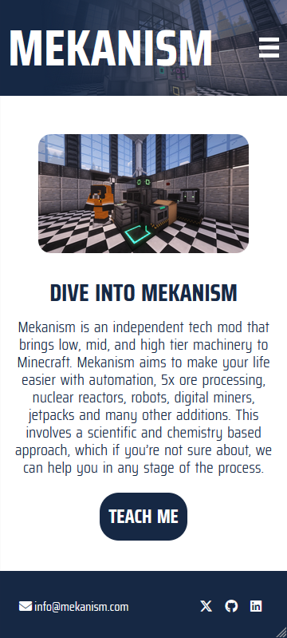

# Testing

Return back to the [README.md](README.md) file.

## Responsiveness

### Home

| Desktop | Tablet | Mobile |
| --- | --- | --- |
|  |  |  |

### About

| Desktop | Tablet | Mobile |
| --- | --- | --- |
|  |  |  |

### Guide Page 

| Desktop | Tablet | Mobile |
| --- | --- | --- |
|  |   |  |

### Download

| Desktop | Tablet | Mobile |
| --- | --- | --- |
|  |  |  |

## Manual Testing

| Test | Goal | Outcome |
| --- | --- | --- |
| Responsiveness | Website should be responsive to all screen sizes | Passed |
| Logo | The logo should redirect the user to the home page if clicked | Passed |
| Nav Links | All navigational links should direct the user to the intended source | Passed |
| Buttons | All buttons should direct the user to the intended source | Passed |
| Social Icons | All social icons should open a separate tab to the appropriate social media | Passed |
| Email | The envelope icon and email should open a seperate tab to gmail | Passed |
| Video | The user should be able to click on, play/pause, adjust volume/mute, search for a timestamp and enlarge any videos. | Passed |
| Jump to top | The user should be brought back to the top of the page upon clicking the icon | Passed |
| Download Links | When either the title or image is clicked, a new tab should be opened to the appropriate link. | Passed |

## Compatibility Testing

Here I manually tested all functionality and features across all responsive sizes and browsers. For this, I used Chrome, Opera, Firefox and Edge.

**Firefox**

**Chrome**

**Opera**

**Edge** 

### Site Speed Tests
For this, I used [Catchpoint's Site Performance Service.](https://www.webpagetest.org/) This allows you to test site performance, speed, core web vitals and visual comparisons on all devices. 

For device compatibilty I tested the following devices:
-Two desktop computers using Firefox and Chrome respectively

-ASUS Notebook PC using Chrome 

-Samsung Galaxy S20 FE

-Samsung Galaxy A12

-Samsung Galaxy M12

-Samsung Galaxy A03

All of these devices had no issues running the site or interacting with features.
    
## User Experience Testing

- I asked some family and friends to load the website on their devices and to test anything that seemed like it was interactable. The feedback was unanimous in that there were no issues.
- The design was clear and easy to understand, they had no issue navigating the site or information presented. 
- They offered some suggestions for design and content that I hope to implement in the future, such as creating a dedicated thumbnail for the showcase video.

## Regression Testing:

After implementing fixes or updates, ensure that previous features and functionalities still work as intended. This prevents new changes from breaking existing features.

## Documentation and Logs:

Maintain records of testing procedures, results, and any bugs encountered along with their resolutions. This helps demonstrate a systematic approach to testing and problem-solving.
User Feedback Incorporation:

## Code Validation
All files were put through the appropriate validators and came back with no errors. 

HTML: For all HTML files, I used the recommended [HTML W3C Validator.](https://validator.w3.org)

Home Page

About Page

Guide Page #1

Guide Page #2

Download Page

Error Page

CSS: For the style sheet I used the [CSS Jigsaw Validator.](https://jigsaw.w3.org/css-validator)

Style Sheet

Javascript: For Javascript I used the [JShint Validator.](https://jshint.com)

Burgermenu Script

Scrollreveal Script

    
